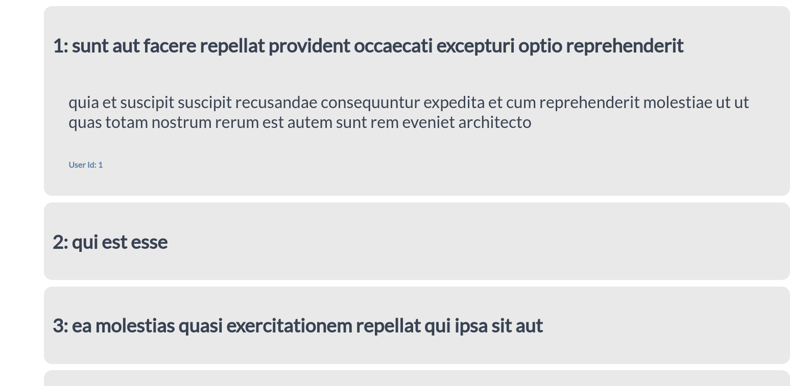
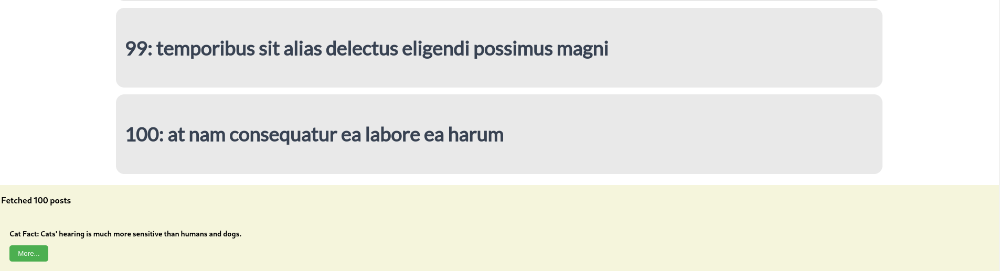
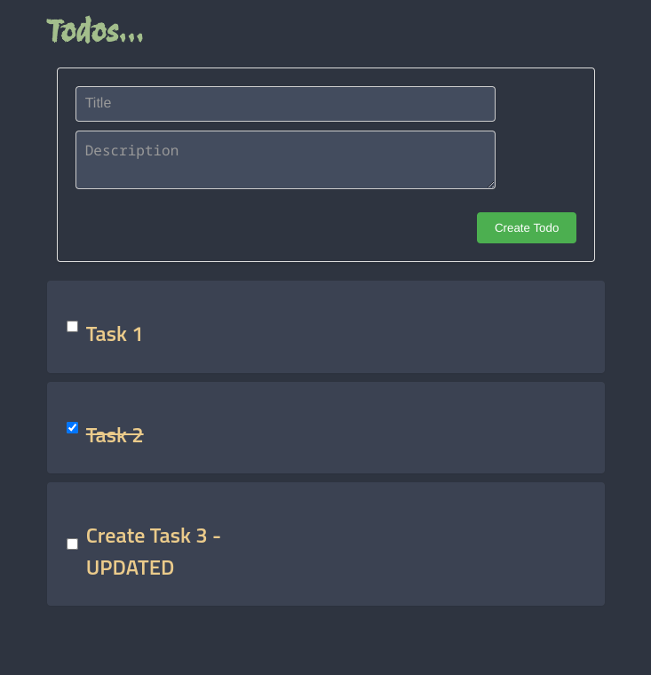

# EY assessment

## Reactjs and Django Assessment

#### Build a Task Manager Web App in 1-1.5 Weeks!

Craft a full-stack web application with Django (backend) and React (frontend) to manage tasks.

**Backend (Django):**

1. Create models for tasks (title, description, completed, etc.).
2. Build REST API endpoints using Django REST Framework:
    * Fetch all tasks.
    * Create new tasks.
    * Update tasks (mark completed).

**Frontend (React):**

1. Set up React app with Create React App.
2. Display retrieved tasks.
3. Create new tasks through a form.
4. Mark tasks complete with a toggle button.

**Integration:**

1. Connect React to Django API.
2. Ensure frontend updates reflect in backend.
3. Show loading states and handle errors gracefully.

**Timeline:** 1-1.5 weeks.

**Bonus:**

* Use Django REST Framework for API development.
* Understand data flow between frontend and backend.
* Master asynchronous operations (API calls, state updates).

## Reactjs Assessment

#### Project Brief: React-powered Post Viewer

**Objective:** Develop a single-page React application that retrieves and displays a list of posts from the JSON Placeholder API: [https://jsonplaceholder.typicode.com/posts](https://jsonplaceholder.typicode.com/posts).

**Key Features:**

* **Data Fetching:** Implement functionality to acquire post data from the specified API endpoint dynamically.
* **Post Display:** Design a UI component to effectively present the retrieved list of posts in a user-friendly manner.
* **Content Toggling:** Integrate a mechanism (button or link) allowing users to switch between viewing full post content and condensed summaries.
* **React Expertise:** Utilize core React concepts like state management, components, lifecycle methods, and functional components with hooks for optimal code structure and efficiency.

**Timeline:** 4-5 days

**Additional Notes:**

* Feel free to leverage any additional libraries or tools deemed beneficial for efficient development.
* Emphasis on implementing modern React practices like functional components and hooks is encouraged.
* A clear understanding of component lifecycles, state management techniques, and handling asynchronous operations is expected.

## Submission

#### ReactJs JSON API Fetch

+ The app shows a list of posts as shown below.

+ When you click on a post, the app has an expanded state which shows a body.

+ The footer present at the bottom, displays the number of posts fetched with a cat fact and a button to refresh the cat fact.

#### ReactJs + Django Task App

+ The App fetches a list of todo present in the Django and presents them as shown below.

+ The App also has an expanded state, which on clicking reveals the description of the todo (optional), and the buttons to update or delete the task.

+ On creation of a todo, The app will alert the user with the ID of the task.

+ On completion of the task, the checkbox can be toggled and it strikesthrough the task to represent completion. Furthermore on clicking the update button, the task's edit page is revealed so that the user can edit the task.

+ The Final state of the App, looks like this.

#### Additional Notes

+ On google chrome, for the TaskApp/TodoApp, if it doesn't load the backend, make sure that CORS is enabled by visiting this link [here](https://webbrowsertools.com/test-cors/) 
